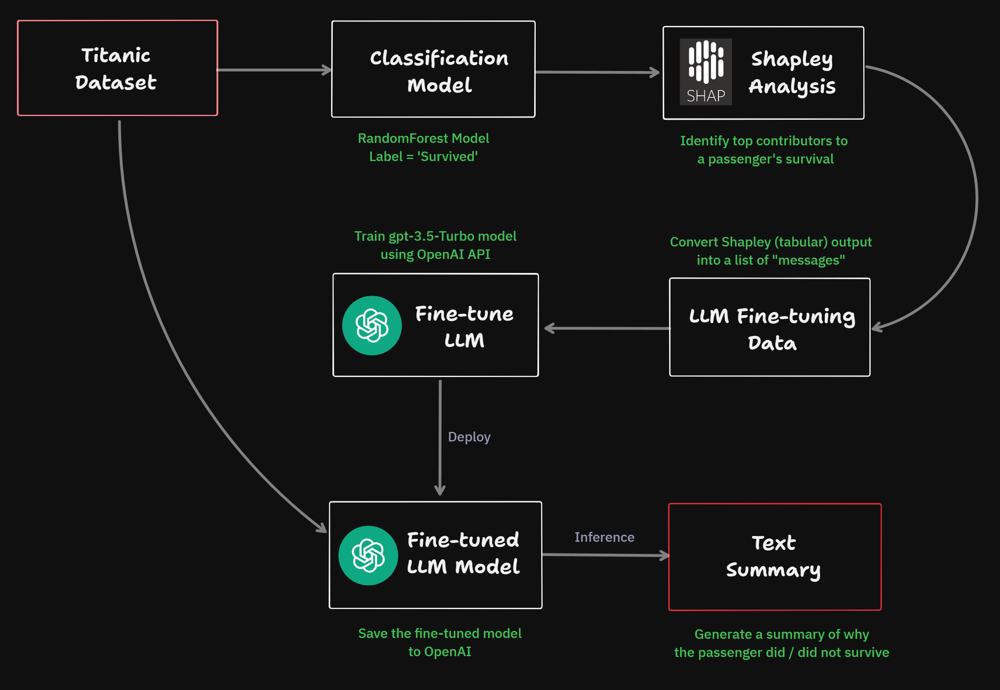

# Fine-tune `gpt-3.5-turbo` to convert Shapley output into a summary

This repo contains a step-by-step guide for fine-tuning `gpt-3.5-turbo` model.

We will use the Titanic dataset for this tutorial. We will first build a (simple) classification model using the target label `survived`. Then we will use Shapley analysis to identify features that contributed to each passenger's survival estimate. The ouput from Shapley analysis will then be used to fine-tune an LLM model.

We will fine-tune a GPT model in such a way that when we provide the output data points from the Shapley analysis to the LLM model, it should be able to generate a summary in plain English that explains why the passenger did or did not survive. 

# Wireframe :clipboard:

Here's the overall wireframe of this approach:

	

# Process :gear:

Here are the steps we will follow:

1. Read the Titanic dataset and prepare the data for modeling.
2. Build a simple classification model.
3. Perform Shapley analysis to identify the top contributors for each passanger.
4. Prepare training data for fine-tuning a GPT model (by converting Shapley output into plain English).
5. Fine-tune `gpt-3.5-turbo` using the training data prepared in the previous step.
6. Make inference on a new passenger (not in the training data) to make sure that the fine-tuned model is working as expected.
7. Build a Gradio UI where a user can choose a passanger and view the results.

# Tools :hammer_and_wrench:

Here's the list of all tools used in this tutorial:

1. [SHAP](https://shap.readthedocs.io/en/latest/index.html) (SHapley Additive exPlanations) package 
2. [OpenAI API](https://platform.openai.com/docs/introduction) for fine-tuning a GPT model
3. [Gradio](https://www.gradio.app/docs) for creating a web-app

# Code :snake:

Checkout [the Jupyter Notebook](./notebooks/titanic.ipynb) for the full tutorial.
